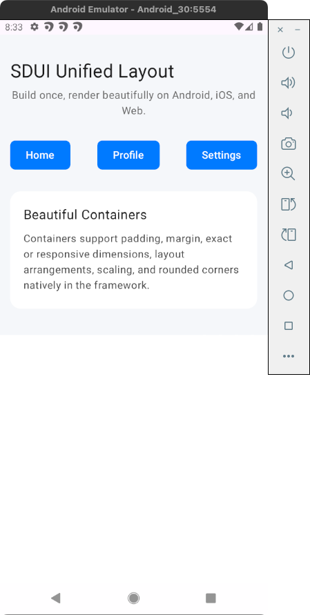
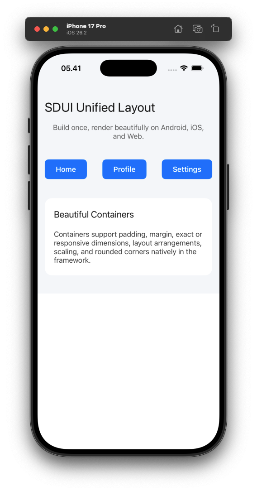
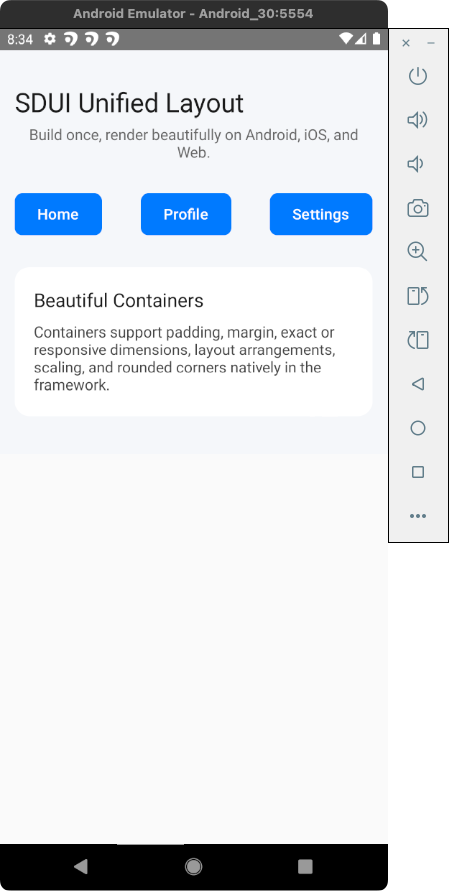
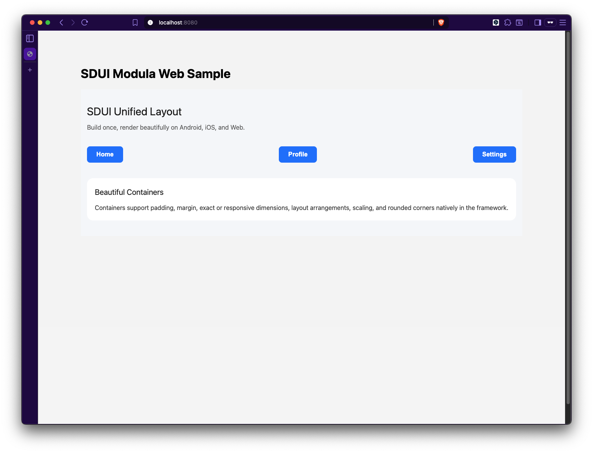

# Modula SDUI SDK (KMP)

MODULA is a powerful Server-Driven UI (SDUI) SDK built with **Kotlin Multiplatform (KMP)**. It enables you to build high-performance, native user interfaces for Android, iOS, Web, and React Native using a single JSON definition.

## 📱 App Previews

| Android (Compose) | iOS (SwiftUI) |
| :---: | :---: |
|  |  |

| React Native | Web (React) |
| :---: | :---: |
|  |  |

---

## 🌳 Project Structure

```text
.
├── apps                    # Sample applications for testing integration
│   ├── rn-sample           # React Native sample app
│   └── web-sample          # Web (React + Vite) sample app
├── packages                # 20% Mapping Logic (Native Hands)
│   ├── android-compose     # Native Android renderer (Jetpack Compose)
│   ├── ios-swiftui        # Native iOS renderer (SwiftUI)
│   ├── react-native-sdui   # React Native Bridge (wraps native renderers)
│   └── react-web-sdui      # Web renderer (React + Kotlin/JS)
├── shared                  # 80% Core Logic (Smart Brain)
│   └── src
│       ├── commonMain      # Core logic used by all platforms
│       ├── androidMain     # Platform-specific glue
│       ├── iosMain         # Platform-specific glue
│       └── jsMain          # Platform-specific glue
├── deploy.sh               # Automation script for packing & deployment
└── README.md
```

---

## 💡 KMM SDUI for Beginners

This project uses **Kotlin Multiplatform (KMP)** to implement **Server-Driven UI (SDUI)** efficiently. Think of it as a "Smart Brain" with "Native Hands".

### The 80/20 Rule
We follow an efficient development ratio:
- **80% Core Logic (`shared/`)**: This is the "Smart Brain" written in Kotlin. It contains 80% of the project's code, including all JSON parsing, data transformations, and business rules. It is the single source of truth for all platforms.
- **20% Mapping Logic (`packages/`)**: These are the "Native Hands". Only 20% of the code is platform-specific, residing in the native rendering packages (Jetpack Compose, SwiftUI, React). These packages map the data from the "Brain" into native UI components.

This ensures **consistent logic** across all platforms while maintaining **100% native performance and feel**.

---

## 🏗️ Project Architecture

- **`shared/`**: The core implementation. Contains parsing and business rules.
- **`packages/`**: Platform rendering engines.
  - `android-compose`: Native Android renderer.
  - `ios-swiftui`: Native iOS renderer.
  - `react-web-sdui`: Web renderer.
  - `react-native-sdui`: The bridge that allows React Native to use these native renderers.
- **`apps/`**: Demonstrations of the SDK in action.

---

## 🚀 Development Workflow

Follow this sequence to build and integrate the SDK across platforms.

### 1. 🧩 Core: KMM Shared Module
Any changes to data models or parsing logic begin in the `shared` module.

```bash
# Clean and build the shared module
./gradlew :shared:assemble
```

### 2. 🎨 Native Renderers

#### **Android (Compose)**
Prepare the Android renderer to be consumed locally or by React Native.
```bash
# 1. Publish Shared Core to Maven Local
./gradlew :shared:publishToMavenLocal

# 2. Publish Android Compose Renderer to Maven Local
./gradlew :packages:android-compose:publishToMavenLocal
```

#### **iOS (SwiftUI)**
iOS requires a compiled XCFramework from the Kotlin code.
```bash
# Generate the Shared XCFramework
./gradlew :shared:assembleSharedReleaseXCFramework
```
*Output: `shared/build/XCFrameworks/release/Shared.xcframework`*

#### **Web (React)**
Build the Kotlin/JS distribution for Web.
```bash
./gradlew :shared:jsBrowserProductionLibraryDistribution
```

---

### 3. ⚛️ React Native Integration (Final SDK)

The React Native bridge (`react-native-sdui`) acts as a wrapper for the native renderers.

#### **Step A: Synchronize Native Dependencies**
React Native needs the latest native artifacts to work.

- **For Android**: The bridge is configured to fetch artifacts automatically from your **Maven Local** (Step 2 above).
- **For iOS**: You must manually sync the `Shared.xcframework` into the iOS bridge.
  ```bash
  # Create the target directory
  mkdir -p packages/react-native-sdui/ios/Frameworks
  
  # Copy the generated XCFramework
  cp -R shared/build/XCFrameworks/release/Shared.xcframework packages/react-native-sdui/ios/Frameworks/
  ```

#### **Step B: Pack the React Native Library**
```bash
cd packages/react-native-sdui
npm run prepare
npm pack
```
*Output: `react-native-sdui-0.1.0.tgz`*

---

## 🛠️ Installation in Your Projects

### **React Native App**
1. **Install the tarball**:
   ```bash
   npm install ../../packages/react-native-sdui/react-native-sdui-0.1.0.tgz
   ```

2. **Android Configuration**:
   Ensure `mavenLocal()` is present in your root `android/build.gradle`:
   ```gradle
   allprojects {
       repositories {
           mavenLocal()
           google()
           mavenCentral()
       }
   }
   ```

3. **iOS Configuration**:
   ```bash
   cd ios && pod install
   ```

### **Native Apps**
- **Android**: Simply add `implementation("com.nostratech.modula:android-compose-android:0.0.1")` to your Gradle dependencies after publishing to Maven Local.
- **iOS**: Add the `packages/ios-swiftui` folder as a local Swift Package in Xcode.

---

## 📋 Requirements
- **Java 17** (for modern Android builds)
- **Kotlin 2.1.10**
- **Xcode 15+**
- **Node.js 18+**

---

© 2026 Nostratech Modula. Built with ❤️ using Kotlin Multiplatform.
