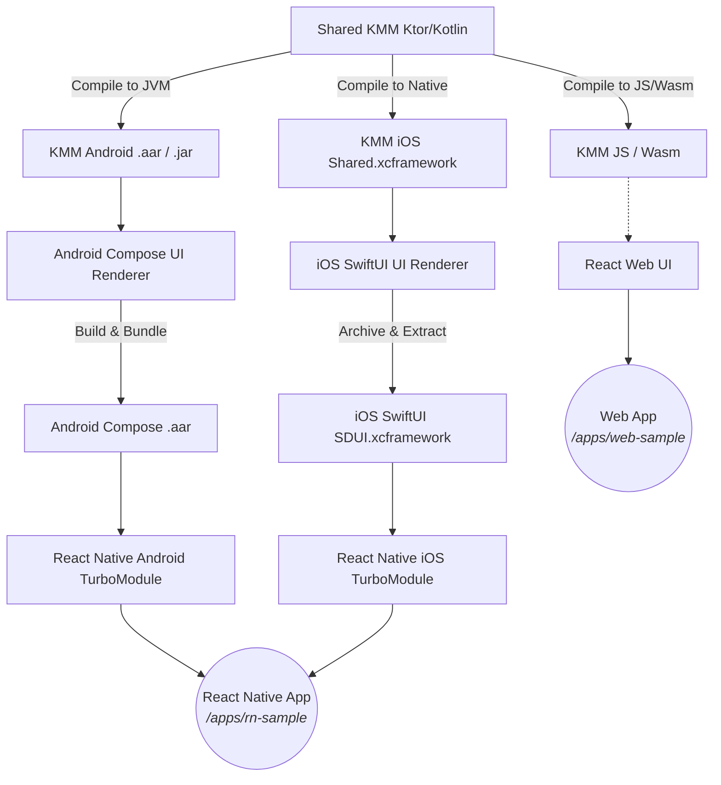

# SDUI SDK Implementation Architecture

Berikut adalah arsitektur diagram (*Plant*) dari implementasi Server-Driven UI (SDUI) SDK yang Anda deskripsikan, menggunakan Kotlin Multiplatform (KMM) sebagai fondasinya.

## Komponen Utama
1. **Shared KMM (Core Parser & Networking):** Menyediakan lapisan logika bersama. Komponen ini mengambil data JSON dari server dan menerapkannya ke dalam model objek (*data classes*) yang dapat dibaca di semua platform pengenal SDUI.
2. **Android Compose (`android-compose`):** Menggunakan Jetpack Compose (Native Android) untuk me-render objek KMM menjadi View nyata (Button, Text, dll). Dibungkus atau digabung sebagai *standalone artifact* berekstensi `.aar`.
3. **iOS SwiftUI (`ios-swiftui`):** Mengadopsi SwiftUI (Native iOS) untuk me-render elemen sesuai dari KMM `Shared.xcframework` ke komponen Apple UI. Digabung ke format *binary package* `.xcframework`.
4. **React Web:** Memanfaatkan *compilation* KMM ke Javascript / WebAssembly untuk bisa me-render DOM Web, disambung langsung dengan komponen UI dari ReactJS.
5. **React Native TurboModule (`react-native-sdui`):** 
    - Tanpa "*Remapping*", implementasi *Bridge*-nya (Fabric Module) hanya perlu meneruskan props `json` (string utuh) dari ranah Javascript/Typescript ke lapis Native.
    - Sisi Android-nya memanggil *dependency* `.aar` Compose dan memetakan langsung render Compose ke root Native RN.
    - Sisi iOS-nya memanggil *dependency* `.xcframework` SwiftUI / *Shared Swift source* dan menampilkannya memakai `UIHostingController`.
6. **Sample / Demo Apps (`/apps`):** Direktori utama tempat aplikasi integrasi siap pakai berada (contoh: proyek end-user React Native atau React Web konvensional). Aplikasi ini merupakan titik masuk di mana SDK SDUI di-inisialisasi.
